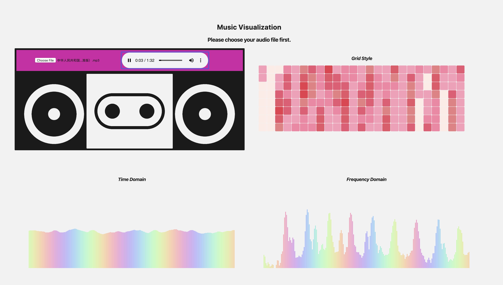

# Music Visualization

###### 16307130322 苏心怡

### 项目结构：

index.html: 前端主要结构

style.css: 前端样式设计

Js文件夹包括三个文件，分别对应三个可视化窗口：时域， 频域， 网格风格显示

### 程序说明：

- 音乐输入：

  需要用户选择本地的音频文件并上传。

  音乐输入采用HTML5的audio元素连接本地音频文件。并采用[Web Audio API](https://developer.mozilla.org/en-US/docs/Web/API/Web_Audio_API) 进行音频数据的提取。

  通过API的[音频分析节点(Analyser Node)](https://developer.mozilla.org/en-US/docs/Web/API/AnalyserNode)，获取音频数据，具体采用了两类数据：

  - [音频的时域数据](https://developer.mozilla.org/en-US/docs/Web/API/AnalyserNode/getByteTimeDomainData)：即为音频当前时间点的波形图，返回值为数组，每个数据点范围0-255
  - [音频的频率数据](https://developer.mozilla.org/en-US/docs/Web/API/AnalyserNode/getByteFrequencyData)：即为音频当前时间点的频率数据，返回值为数组，每个数据点范围0-255

- 可视化：

  采用d3.js进行可视化，总体效果如下图：共实现了三种可视化，包括时域， 频域和网格化的表示，时域图的纵坐标表示响度，频域的纵坐标表示频率高低，网格的深浅表示频率高低。

  

### 参考链接：

- [Web Audio API](https://developer.mozilla.org/en-US/docs/Web/API/Web_Audio_API)
- [Example code](https://developer.mozilla.org/en-US/docs/Web/API/Web_Audio_API/Using_Web_Audio_API)
- [Audio Get Time Domain Data](https://developer.mozilla.org/en-US/docs/Web/API/AnalyserNode/getByteTimeDomainData)
- [Audio Get Frequency Data](https://developer.mozilla.org/en-US/docs/Web/API/AnalyserNode/getByteFrequencyData)
- [d3.js](https://d3js.org/)
- [d3 Grid Style](http://bl.ocks.org/tjdecke/5558084)